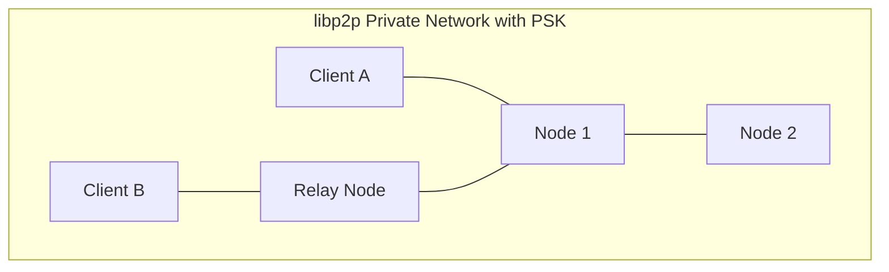
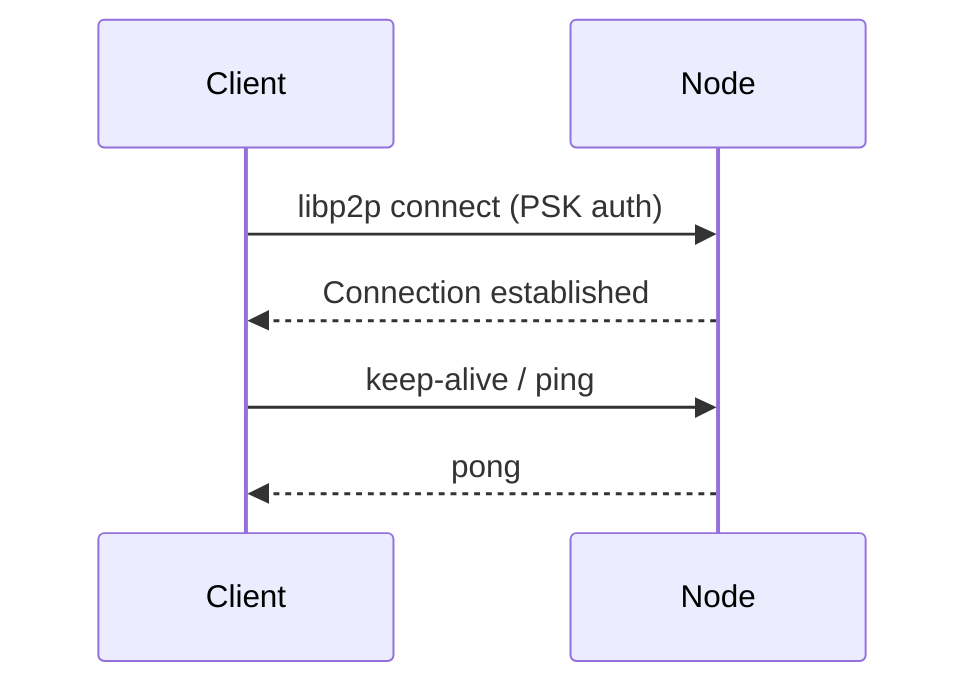
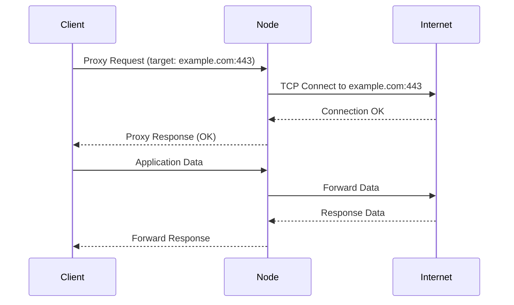

# Architecture

This document explains the architecture and components of Bethrou.

## System Overview

Bethrou consists of two main components that communicate over a peer-to-peer network:


## Components

### 1. Client

The **Bethrou Client** runs on the user's device and provides a SOCKS5 proxy interface.

**Responsibilities:**
- Accept SOCKS5 connections from local applications
- Maintain connections to one or more exit nodes
- Route proxy requests to appropriate exit nodes based on strategy
- Handle connection pooling and health checks
- Discover new nodes (via Redis or static configuration)

### 2. Node (Exit Node)

The **Bethrou Node** runs on a server and acts as an exit point for proxied traffic.

**Responsibilities:**
- Listen for incoming libp2p connections from clients
- Accept proxy requests via custom protocol over libp2p streams
- Establish TCP connections to destination addresses
- Forward traffic bidirectionally between client and destination
- Optionally act as a relay node for NAT traversal
- Publish presence to discovery service (Redis)

### 3. Discovery Service (Optional)

Uses **Redis pub/sub** for dynamic node discovery.

**How it works:**
1. Nodes publish their peer ID and addresses to a Redis topic
2. Clients subscribe to the topic and discover available nodes
3. Clients maintain a dynamic list of exit nodes
4. Health checks remove unresponsive nodes

## Network Architecture

## Private Network Layer

Bethrou uses **pre-shared keys (PSK)** to create isolated libp2p networks:



**Security Properties:**
- Only peers with the correct PSK can join the network
- libp2p transport encryption (TLS/Noise) protects data in transit
- Network is isolated from the public DHT

## Communication Flow

### 1. Connection Establishment



### 2. Proxy Request



## Routing Strategies

Clients can use different strategies to select exit nodes:

### Random
Selects a random healthy node for each connection.

**Pros:** Simple, good load distribution
**Cons:** No optimization for performance

### Round-Robin
Rotates through available nodes in order.

**Pros:** Fair distribution, predictable
**Cons:** May route to slower nodes

### Fastest
Selects the node with the lowest latency.

**Pros:** Best performance
**Cons:** All traffic may route through one node

## NAT Traversal

Bethrou supports NAT traversal through relay nodes:


**How it works:**

1. Relay nodes run with `--relay-mode` flag

2. Clients and nodes behind NAT connect to relay

3. Relay facilitates connection between NAT'd peers

4. Once connected, data flows through relay (circuit relay)

## Security Considerations

### Trust Model

- **Clients trust nodes**: Exit nodes can observe all proxied traffic
- **Nodes trust clients**: Nodes forward traffic for authenticated clients
- **PSK provides authentication**: Only holders of the network key can participate

### Best Practices

1. **Trust your exit nodes**: Only use nodes you control or trust
2. **Use HTTPS**: Exit nodes cannot decrypt HTTPS traffic
3. **Rotate PSK**: Change network keys periodically
4. **Monitor nodes**: Track which nodes are active in your network
5. **Limit access**: Don't share PSK with untrusted parties

## Performance Characteristics

### Latency

```text
Total Latency = Client → Node + Node → Destination

Typical overhead: 10-50ms depending on:
- Physical distance to exit node
- libp2p transport type (TCP, QUIC, WebRTC)
- Network conditions
```

### Throughput

- **Limited by**: Slowest link in the chain
- **Bottleneck**: Usually the exit node's internet connection
- **Connection pooling**: Reuses libp2p streams for efficiency

### Scalability

- **Clients**: Can connect to multiple nodes for redundancy
- **Nodes**: Can handle hundreds of concurrent clients
- **Discovery**: Redis pub/sub scales to thousands of nodes

## Next Steps

- Review [security model](./security.md)
- Check out [configuration guide](../guides/configuration.md)
