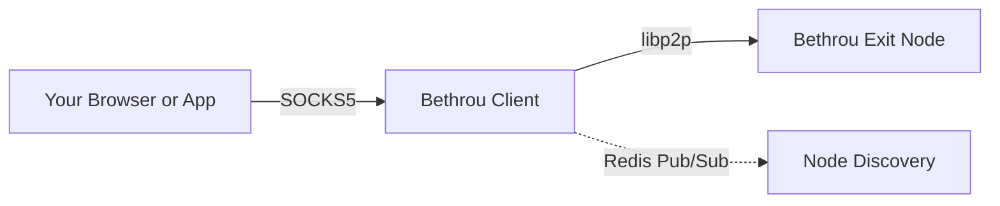

# Introduction

Welcome to **Bethrou**, a simple peer-to-peer proxy network built on [libp2p](https://libp2p.io/).

## What is Bethrou?

Bethrou is a **peer-to-peer proxy network** that allows you to route your internet traffic through trusted exit nodes using a private network. It's an MVP (Minimum Viable Product) designed to demonstrate decentralized proxy functionality.

### Key Features

- **Private Networks**: Uses pre-shared keys (PSK) for network isolation
- **P2P Architecture**: Built on libp2p for robust peer-to-peer communication
- **SOCKS5 Proxy**: Local SOCKS5 server for easy browser/application integration
- **NAT Traversal**: Support for relay nodes to handle NAT and firewall issues
- **Node Discovery**: Redis-based pub/sub for dynamic node discovery
- **Load Balancing**: Multiple routing strategies (random, round-robin, fastest)

## How It Works

1. **Client** starts and loads exit node addresses (static or via discovery)
2. **Client** creates a SOCKS5 proxy server on `localhost:1080`
3. Applications connect to the SOCKS5 proxy
4. **Client** establishes libp2p connections to exit nodes
5. Proxy requests are forwarded through libp2p streams to exit nodes
6. **Exit nodes** make actual TCP connections to destination addresses
7. Traffic flows: `App → SOCKS5 → libp2p → Exit Node → Internet`

## Use Cases

- **Privacy**: Route traffic through trusted nodes you control
- **Testing**: Test applications from different network locations
- **Development**: Create isolated network environments for testing
- **Learning**: Understand P2P networking and libp2p architecture

## Project Status

🚧 **This is an MVP** - a minimum viable product for demonstration and learning purposes.

**What works:**

- ✅ Private P2P networks with PSK

- ✅ SOCKS5 proxy interface

- ✅ NAT traversal via relay nodes

- ✅ Redis-based node discovery

- ✅ Multiple routing strategies

- ✅ Connection pooling and health checks

**Limitations:**

- No authentication/authorization system

- Limited error handling in some areas

- No persistent configuration management

- Discovery mechanism is basic

- No built-in encryption beyond libp2p transport

## Tech Stack

- **Language**: Go 1.24.7
- **Networking**: libp2p for P2P communication
- **Discovery**: Redis with pub/sub
- **Proxy**: SOCKS5 protocol
- **Transport**: Multiple libp2p transports (TCP, QUIC, WebRTC)

## Next Steps

Ready to get started? Head over to the [Installation](./installation.md) guide to set up Bethrou.
