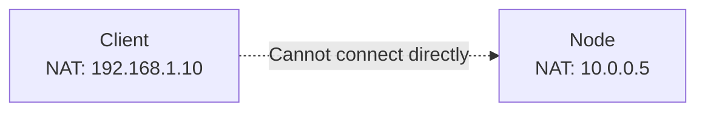
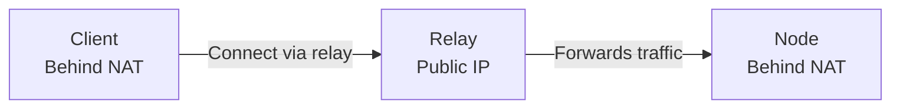

# NAT Traversal Setup

Guide for configuring NAT traversal using relay nodes.

## Understanding NAT Traversal

### The Problem

Peers behind NAT/firewall cannot accept direct connections:



### The Solution

Use a relay node with public IP:



## Relay Node Setup

### Requirements

- Public IP address
- Open port (typically 4000)
- Sufficient bandwidth
- Reliable uptime

### Start Relay Node

```bash
bethrou-node start \
  --listen /ip4/0.0.0.0/tcp/4000 \
  --relay-mode \
  --discover \
  --discover-address redis://discovery.example.com:6379 \
  --discover-topic bethrou-network
```

### Verify Relay

Check logs for relay status:
```
INFO  Relay mode enabled
INFO  Listening on: /ip4/0.0.0.0/tcp/4000
```

Test from outside:
```bash
nc -zv relay-ip 4000
```

## Client Configuration

### Option 1: Explicit Relay

Specify relay in node configuration:

```yaml
key: "network.key"

server:
  listen: "127.0.0.1:1080"
  auth: false

routing:
  strategy: random
  health: 30s
  timeout: 10s

nodes:
  - id: 12D3KooWNode...
    relay: /ip4/203.0.113.100/tcp/4000/p2p/12D3KooWRelay...

discovery:
  enabled: false

log:
  level: info
  format: text
```

### Option 2: Auto Discovery

Let libp2p find relay automatically:

```yaml
key: "network.key"

server:
  listen: "127.0.0.1:1080"
  auth: false

routing:
  strategy: random
  health: 30s
  timeout: 10s

nodes: []

discovery:
  enabled: true
  address: "redis://discovery.example.com:6379"
  topic: "bethrou-network"
  timeout: "10s"

log:
  level: info
  format: text
```

## Exit Node Behind NAT

### Configuration

Exit node connects to relay:

```bash
bethrou-node start \
  --listen /ip4/0.0.0.0/tcp/4000 \
  --connect-relay /ip4/192.168.0.100/tcp/4000/p2p/12D3KooWRelay...
```

The node will:
1. Connect to relay
2. Accept incoming connections via relay
3. Forward traffic to clients or hole punch

## Testing NAT Traversal

### 1. Deploy Relay

On a server with public IP:
```bash
bethrou-node start \
  --listen /ip4/0.0.0.0/tcp/4000 \
  --relay-mode
```

### 2. Start Node (Behind NAT)

```bash
bethrou-node start \
  --listen /ip4/0.0.0.0/tcp/4000 \
  --connect-relay /ip4/relay-ip/tcp/4000/p2p/12D3KooWRelay...
```

### 3. Start Client (Behind NAT)

```yaml
key: "network.key"

server:
  listen: "127.0.0.1:1080"
  auth: false

routing:
  strategy: random  
  health: 30s
  timeout: 10s

nodes:
  - id: 12D3KooWNode...
    relay: /ip4/relay-ip/tcp/4000/p2p/12D3KooWRelay...

discovery:
  enabled: false

log:
  level: info
  format: text

```

### 4. Test Connection

```bash
curl --socks5 127.0.0.1:1080 https://ifconfig.me
```

## Security Considerations

### Relay Trust

Relay can observe:
- Connection metadata
- Peer IDs and addresses
- Connection timing

Relay cannot observe:
- Proxied traffic (encrypted by libp2p)
- Destination addresses (handled by exit node)

### Best Practices

1. **Run your own relays**: More control and privacy
2. **Multiple relays**: Redundancy and load distribution
3. **Monitor relay logs**: Watch for abuse
4. **Rate limiting**: Prevent resource exhaustion
5. **Firewall rules**: Restrict relay access if needed

## Troubleshooting

### Client cannot connect via relay

**Check relay is running:**
```bash
nc -zv relay-ip 4000
```

**Check logs:**
```bash
# Client
bethrou-client connect --log-level debug

# Node
bethrou-node start --log-level debug
```

**Verify discovery:**
```bash
redis-cli PUBSUB CHANNELS bethrou-*
```

## Next Steps

- [Docker Deployment](./deployment-docker.md)
- [Configuration Guide](./configuration.md)
- [Security Best Practices](../concepts/security.md)
